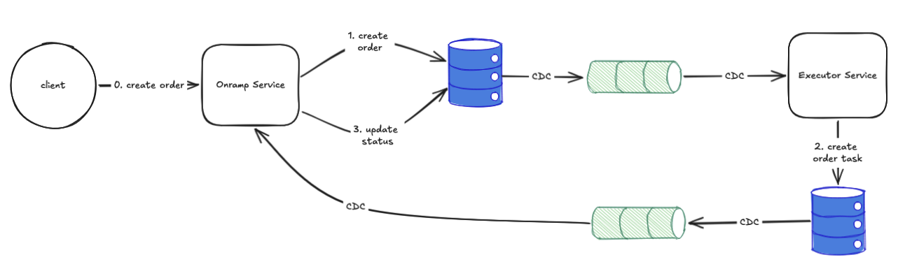
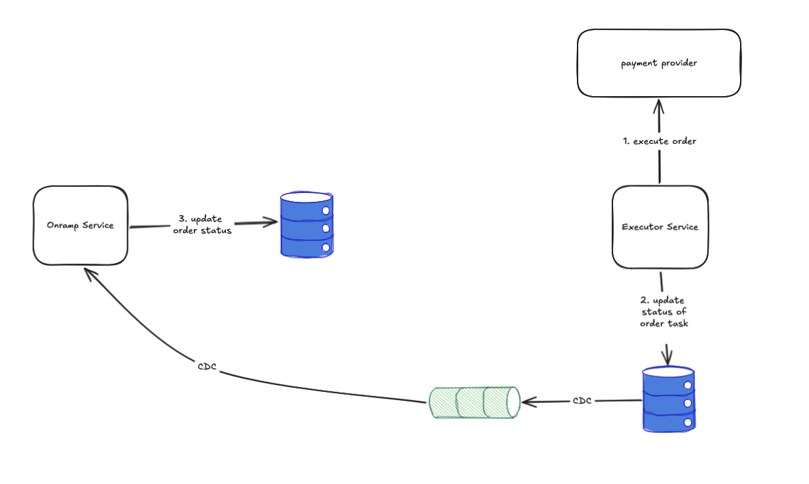
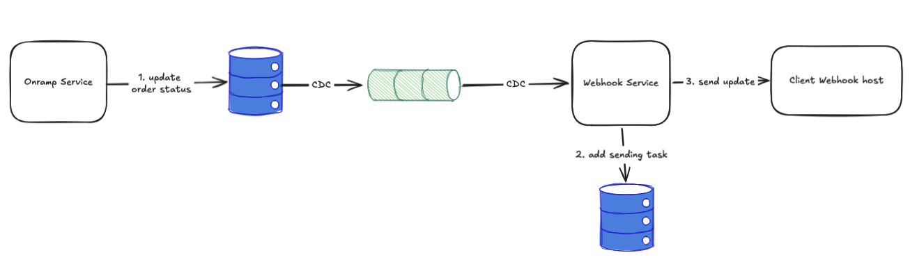

## Onramp Service

This service provides quotes, accepts orders, executes them via a mock provider, and sends order status updates to the client’s webhook.

---

## Architecture

The system consists of several workflows.


### Getting Quotes

The Onramp Service accepts quote requests, performs AML checks, and returns a signed quote response.

### Publishing Orders

Based on a previously received quote, a client can create an order.



When a new order is created, the Executor Service receives an event and creates an Order Task for execution. The executor attempts to process the order via the provider until it is completed or the maximum number of retries is reached.

The Onramp Service receives updates about Order Task status changes and updates the order status accordingly.



The Webhook Service listens for order status updates. When an update is received, a webhook delivery task is added to a queue. The system retries sending until it succeeds or the maximum retry limit is reached.


    
## API

### Onramp Service

#### Getting quote
`POST /api/v1/quotes/{currency_from}/{currency_to}`

Request:
```bash
curl -s -X POST http://localhost:8000/api/v1/quotes/USD/EUR \
  -H "Content-Type: application/json" \
  -d '{"amount": 5000}'
```

Response:
```json
{
    "from": "USD",
    "to": "EUR",
    "amount": 5000.0,
    "fee": 5.0,
    "rate": 0.92,
    "expired_at": "2026-03-02T03:03:32Z",
    "signature": "bfb86188d07e56756d53f8674fd9f3e80fb9ff3d0cde1bcdb30e93742314d9be"
}
```

#### Create Order
`POST /api/v1/orders` 

Request:
```bash
QUOTE_JSON=$(curl -s -X POST http://localhost:8000/api/v1/quotes/USD/EUR \
  -H "Content-Type: application/json" \
  -d '{"amount": 1000}')

curl -s -X POST http://localhost:8000/api/v1/orders \
  -H "Content-Type: application/json" \
  -H "Authorization: Bearer YOUR_JWT" \
  -H "Idempotency-Key: my-idem-key-001" \
  -d "{\"quote\": $QUOTE_JSON}"
```

Response: 
```json
{
    "order_id": "fbf500b3-f417-4959-a92d-27eaa1bee7fc"
}
```

### Webhook Service

#### Register a webhook url
`POST /api/v1/clients/webhooks`

Request:
```bash
curl -s -X POST http://localhost:8001/api/v1/clients/webhooks \
  -H "Content-Type: application/json" \
  -H "Authorization: Bearer YOUR_JWT" \
  -d '{"url": "https://example.com/webhook", "signature_secret": "my-signature-secret"}'
```

Response: 
```json 
{ 
	"id" : "550e8400-e29b-41d4-a716-446655440000"
}
```


### Technologies
All services are written in **Python 3** using **FastAPI**.  
**Kafka** is used for asynchronous communication between services.   
**Debezium** is used to publish Change Data Capture (CDC) events from **PostgreSQL** tables.  
**Alembic** is used for SQL database migrations.  

### Trade-offs
Polling tables are used in several parts of the system, including webhook delivery and order execution, using the `SELECT ... FOR UPDATE SKIP LOCKED` approach. This may become a bottleneck at high data volumes, as frequent polling increases database load and limits horizontal scalability.   
As an alternative, the system could use multiple event queues grouped by retry attempt.

In case of delivery errors, it is possible that a `COMPLETED` status update is sent before a `PROCESSING` update.   
This can be mitigated by checking for existing pending delivery tasks for the same order and postponing the new task if earlier status updates are still queued.

## Usage

**Poetry** is used for building and running tests. **Docker** and **Docker compose** are used for running the services in containers.

### Build

```bash
poetry install
```

### Tests

```bash
poetry run pytest tests/unit -v
poetry run pytest tests/integration -v
```

For manual testing, the script `scripts/onramp-demo.sh` might be useful: 

```bash
./onramp-demo.sh                     # use defaults
./onramp-demo.sh get-quote
./onramp-demo.sh create-order
./onramp-demo.sh set-webhook [url]   # register webhook URL (default https://example.com/webhook)
./onramp-demo.sh all [webhook_url]   # run get-quote, create-order, set-webhook
```

### Run

```bash
cd executor
cp .env.example .env 
poetry install
alembic upgrade head
poetry run uvicorn app.main:app --host 0.0.0.0 --port 8002
```

or with **Docker Compose**:

```bash
docker-compose up
```
